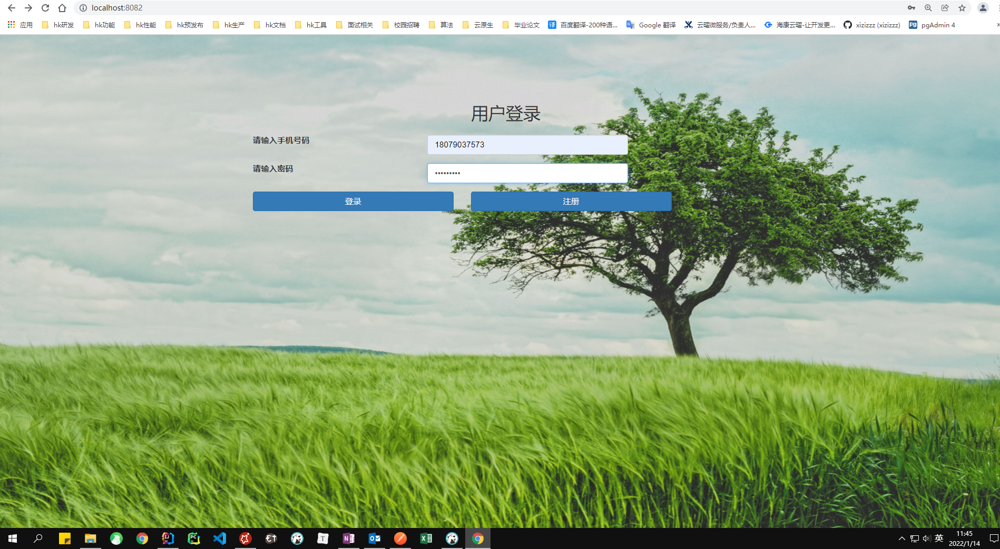
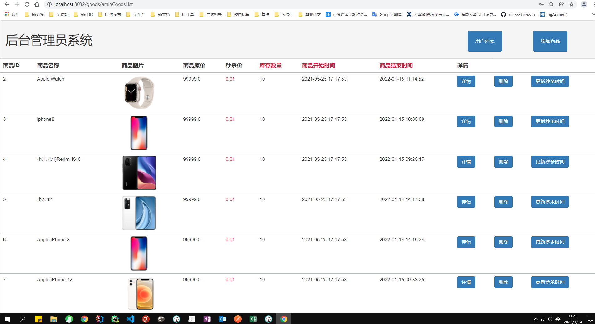
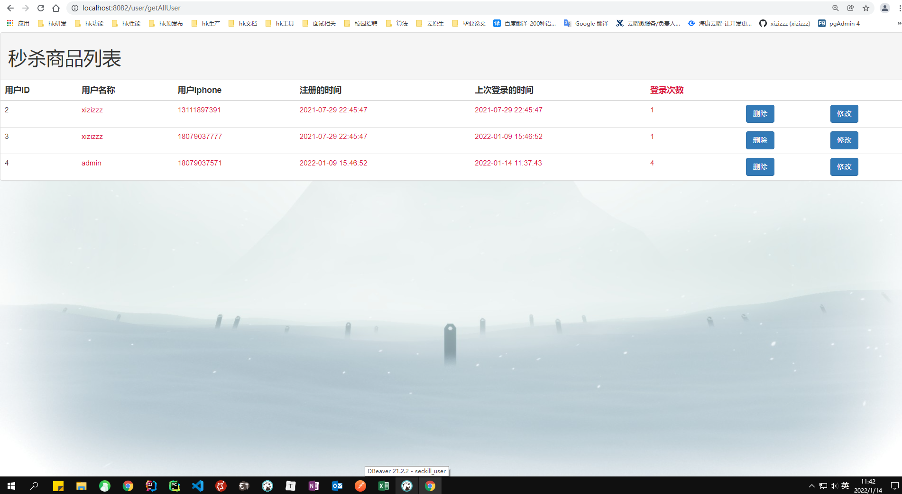
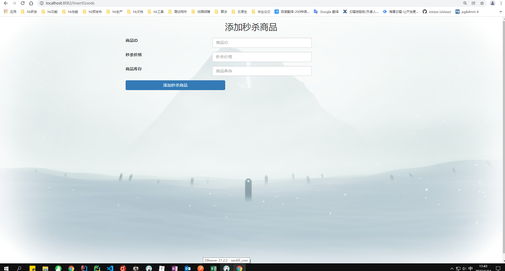
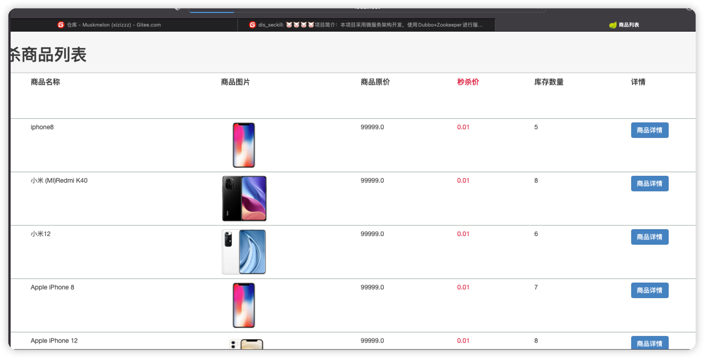
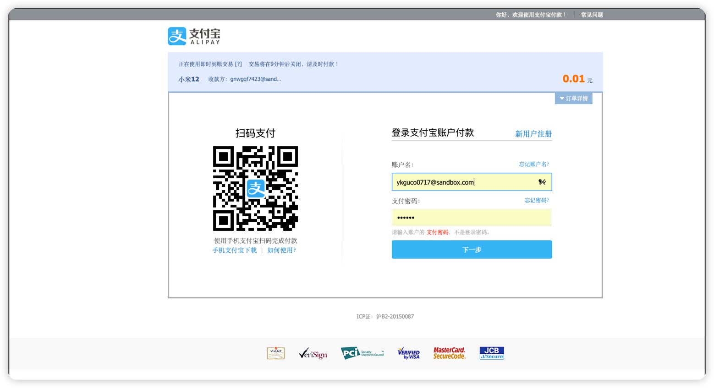
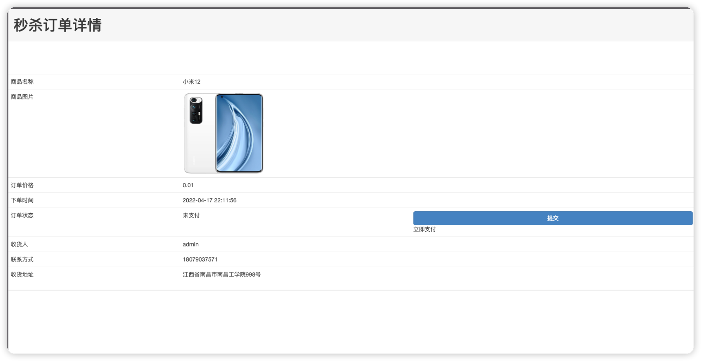
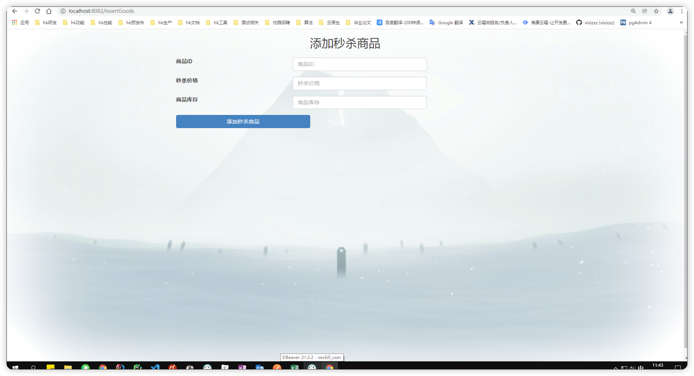
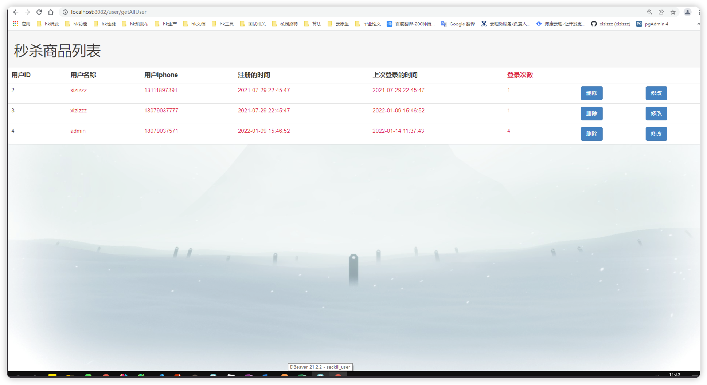

# dis_seckill

#### 介绍
🐍🐍🐍🐍项目简介：本项目采用微服务架构开发，使用Dubbo+Zookeeper进行服务间的调用，通过缓存、 异步，限流进行系统的优化，解决商品超卖，用户重复下单，商品限流防刷等问题。 项目技术：SpringBoot+Dubbo+Zookeeper+Redis+MySQL+RabbitMQ+Mybatis等框架。

<!-- PROJECT SHIELDS -->

[![Contributors][contributors-shield]][contributors-url]
[![Forks][forks-shield]][forks-url]
[![Stargazers][stars-shield]][stars-url]
[![MIT License][license-shield]][license-url]

<!-- PROJECT LOGO -->
 

    
    <h3 align="center">字节青训营抖音项目</h3>
  

    ·
    <a href="https://github.com/hakusai22/dis_seckill/issues">报告Bug</a>
    ·
    <a href="https://github.com/hakusai22/dis_seckill/issues">提出新特性</a>
  

<!-- links -->
[your-project-path]:hakusai22/dis_seckill
[contributors-shield]: https://img.shields.io/github/contributors/hakusai22/dis_seckill.svg?style=for-the-badge
[contributors-url]: https://github.com/hakusai22/dis_seckill/graphs/contributors
[forks-shield]: https://img.shields.io/github/forks/hakusai22/dis_seckill.svg?style=for-the-badge
[forks-url]: https://github.com/hakusai22/dis_seckill/network/members
[stars-shield]: https://img.shields.io/github/stars/hakusai22/dis_seckill.svg?style=for-the-badge
[stars-url]: https://github.com/hakusai22/dis_seckill/stargazers
[issues-shield]: https://img.shields.io/github/issues/hakusai22/dis_seckill.svg?style=for-the-badge
[issues-url]: https://img.shields.io/github/issues/hakusai22/dis_seckill.svg
[license-shield]: https://img.shields.io/github/license/hakusai22/dis_seckill.svg?style=for-the-badge
[license-url]: https://github.com/hakusai22/dis_seckill/blob/master/LICENSE
[linkedin-shield]: https://img.shields.io/badge/-LinkedIn-black.svg?style=for-the-badge&logo=linkedin&colorB=555
[linkedin-url]: https://linkedin.com/in/xxxx

## 目录

- [上手指南](#上手指南)
    - [开发前的配置要求](#开发前的配置要求)
    - [安装步骤](#安装步骤)
- [文件目录说明](#文件目录说明)
- [项目特点](#项目特点)
- [功能介绍](#功能介绍)
- [开发的架构](#开发的架构)
- [部署](#部署)
- [使用到的框架](#使用到的框架)
- [贡献者](#贡献者)
    - [如何参与开源项目](#如何参与开源项目)
- [版本控制](#版本控制)
- [作者](#作者)
- [鸣谢](#鸣谢)
- [成果演示](#成果演示)

### 上手指南

###### 开发前的配置要求

## 用户界面

### 用户注册

### 用户登录

### 用户商品界面

### 商品详细页面

### 秒杀成功页面

### 订单详细页面

## 后台管理员

### 全部的秒杀用户列表

### 添加秒杀商品

