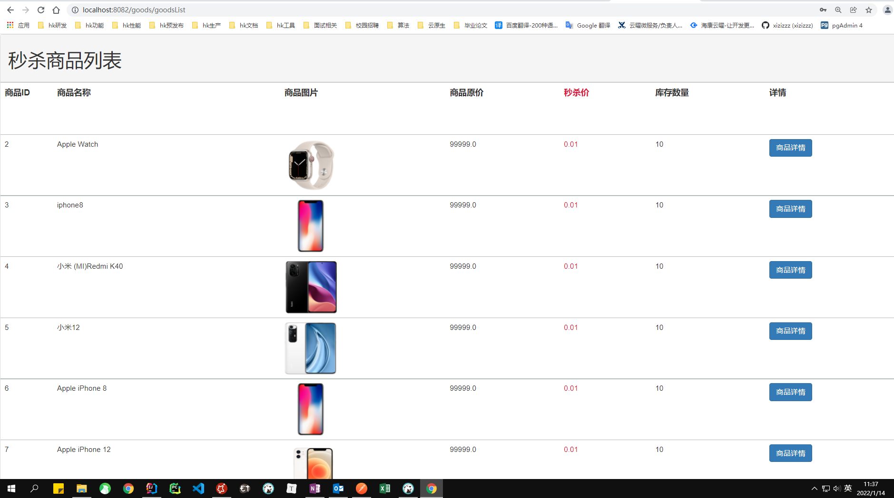
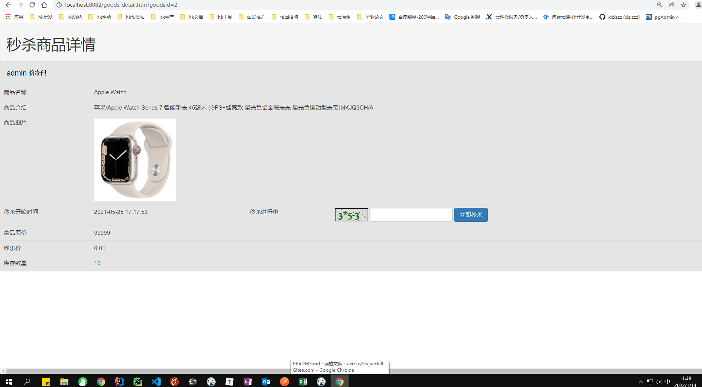
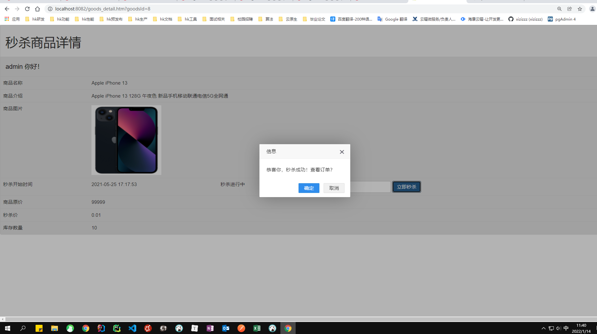
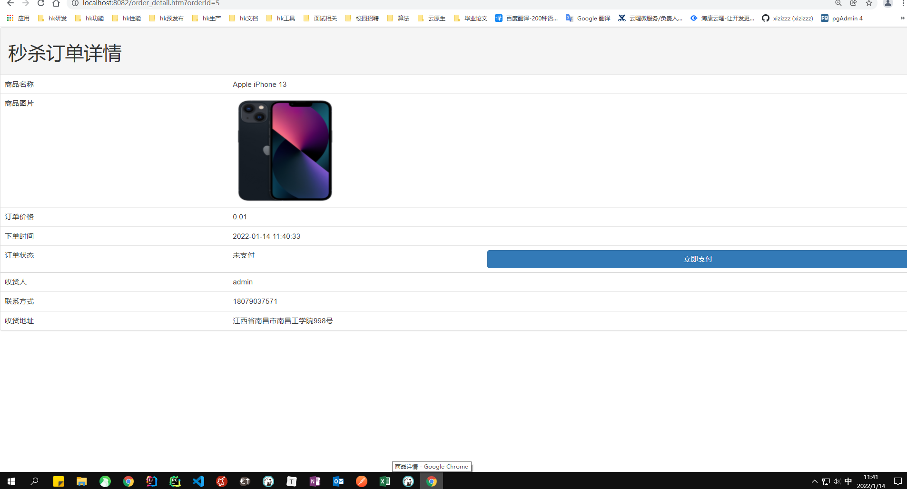

# dis_seckill

#### 介绍
🐷🐷🐷🐷项目简介：本项目采用微服务架构开发，使用Dubbo+Zookeeper进行服务间的调用，通过缓存、 异步，限流进行系统的优化，解决商品超卖，用户重复下单，商品限流防刷等问题。 项目技术：SpringBoot+Dubbo+Zookeeper+Redis+MySQL+RabbitMQ+Mybatis等框架。

### 用户界面

### 商品详细页面

### 秒杀成功页面

### 订单详细页面
